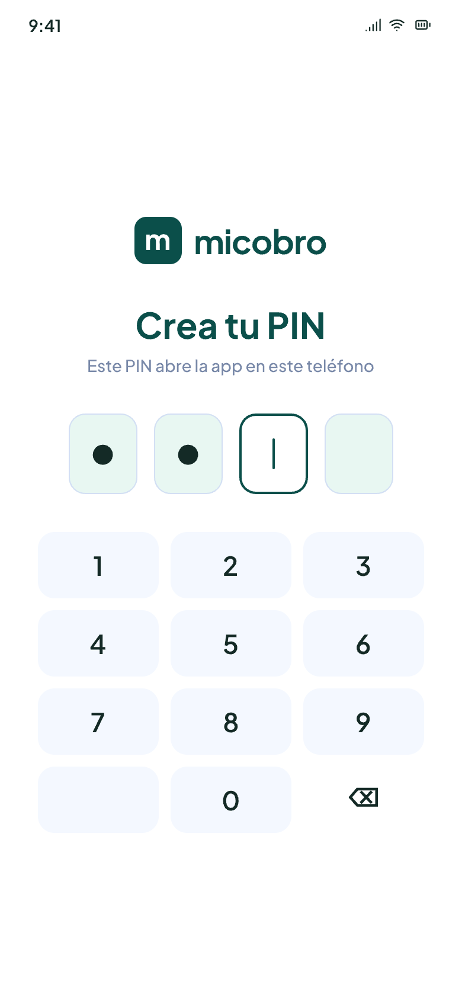
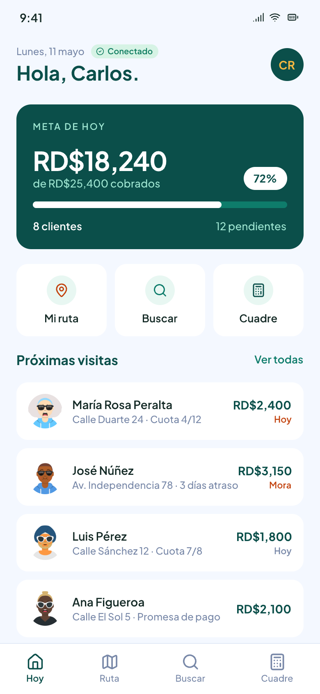
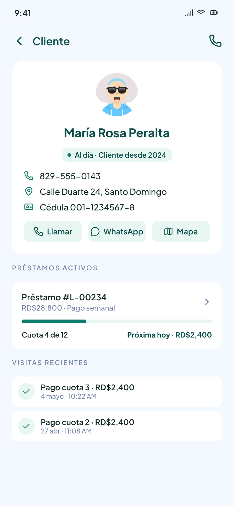
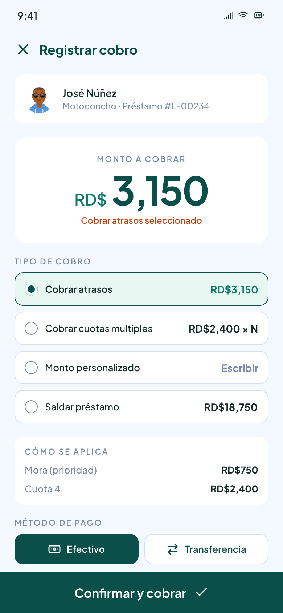
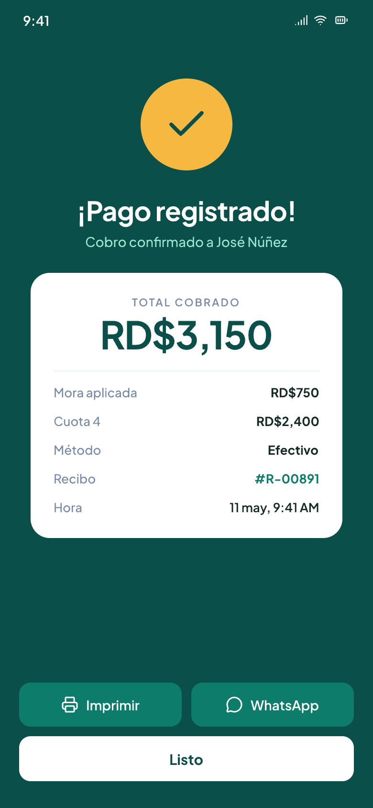

<p align="center">
  
</p>

Offline-first Android app for independent, informal lenders (prestamistas) in the
Dominican Republic to track customers, loans, and payments. There's no backend
server: a local SQLite database is the source of truth on-device, and each
lender's data syncs to a Google Sheet they own — adding a customer directly in
the sheet is a supported editing path, not just an export.

## Product design

The product design lives in `pencil.pen` (edited with [Pencil](https://pencil.dev));
`assets/screens/` holds exports of the key flows. Onboarding is PIN-first — Google
is optional backup, never a login wall:

<p align="center">
  
  
  
  
  
</p>

## Stack

- **Expo / React Native** (Android-first), **Expo Router** for navigation.
- **drizzle-orm** on **expo-sqlite** for local persistence (Prisma can't run
  on-device — its query engine needs a native binary or WASM, neither of
  which Hermes supports).
- **Google Sheets API v4** over plain `fetch`, authorized per-lender via
  Google Sign-In (OAuth + PKCE) — no service-account secret ships in the APK.
- **Zod** validated-function pattern for business logic; **Jest** (`jest-expo`
  preset) for tests, since Expo/RN requires it over mocha.
- **Storybook** (`@storybook/react-native`) for component-driven UI dev.
- **Maestro** for E2E smoke flows.

## Getting started

```bash
nvm use          # Node >= 22
npm install
npm run db:generate   # generates lib/db/migrations from lib/db/schema.ts
npm start             # expo start --clear
npm run android       # expo run:android
```

### Prerequisites

- **Maestro CLI** (E2E, not an npm dependency):
  `curl -fsSL https://get.maestro.mobile.dev | bash`, then
  `npm run test:e2e` (needs a running emulator/device and `-e APP_ID=com.micobro.app`
  passed to the underlying `maestro test` invocation on Android).
- **Google OAuth client ID** for Sheets sign-in: create an OAuth client
  (Android or Web application type) in Google Cloud Console with the
  `https://www.googleapis.com/auth/drive.file` scope (least-privilege —
  access only to spreadsheets this app creates), then set
  `EXPO_PUBLIC_GOOGLE_OAUTH_CLIENT_ID` in a local `.env` (gitignored).
  Without it, the "Continuar con Google" button is disabled with an inline
  note; "Ahora no" / staying local still works fully offline.
- App icon/splash assets aren't set up yet — `assets/` has the README banner,
  design-screen exports (`assets/screens/`), and placeholder customer avatars
  (`assets/avatars/`) only. Add `icon.png` / adaptive icon assets before
  running a real build (the "App Icons" frame in `pencil.pen` has the artwork).
- **Web preview isn't available yet.** `react-native-web` isn't a listed
  dependency, so `expo start --web` starts a dev server but fails to bundle
  (`Unable to resolve module react-native-web/dist/index`). Use an
  Android emulator/device (`npm run android`) to see the running app.

## Scripts

| Script                           | Purpose                                                               |
| :------------------------------- | :-------------------------------------------------------------------- |
| `npm run lint` / `lint:fix`      | eslint                                                                |
| `npm run typecheck`              | `tsc --noEmit`                                                        |
| `npm test`                       | Jest unit tests                                                       |
| `npm run test:e2e`               | Maestro flows under `.maestro/`                                       |
| `npm run db:generate`            | Regenerate drizzle migrations from the schema                         |
| `npm run start:storybook:native` | Component dev in Storybook                                            |
| `npm run start:demo`             | App with in-memory mock data, no real device DB or Google auth needed |

## How the app is put together

- **No username/password, ever.** The only local "auth" is a 4-digit PIN
  (`lib/security/pin.ts`, `app/onboarding/pin.tsx`, `app/desbloquear.tsx`) —
  it's mandatory on first run (nothing else gates the app) and unlocks it on
  every subsequent open. Google Sign-In is a completely separate, always
  optional concern for backing data up to Sheets, offered right after PIN
  setup ("Continuar con Google" or "Ahora no, tal vez después") and
  reachable any time after from Settings.
- **`lib/repo/`** is the data-access seam screens use instead of touching
  drizzle or `lib/<domain>` factories directly: one `Repos` interface
  (`CustomerRepo`, `LoanRepo`, `PaymentRepo`, `SyncRepo`), a real
  implementation (`real/`, thin adapters over the validated-function
  factories) and a mock implementation (`mock/`, interactive in-memory
  fixtures), both wired through `RepoProvider`/`app/_layout.tsx`. Swap
  between them with `EXPO_PUBLIC_USE_MOCK_REPOS=true` (`npm run start:demo`)
  — no screen code changes needed.
- **Screens** (`app/` + `components/screens/`): onboarding (PIN + Google/stay-local
  choice), PIN unlock, a tabbed shell (Hoy/Ruta/Buscar/Cuadre),
  customer list/detail + new-customer form, loan list/detail + new-loan form,
  record-a-payment, and sync settings (status, push now, disconnect, manual
  lock) — all gated through Expo Router's `Stack.Protected`.
- **`lib/customers/`, `lib/loans/`, `lib/payments/`** — one validated-function
  factory per operation (create/get/list), each with Jest coverage, following
  `lib/customers/createCustomer.ts` as the reference pattern.
- **`lib/sync/`** — Google Sign-In (OAuth + PKCE, `drive.file` scope), a
  Sheets API v4 client, and `pushPendingMutations` to replay the local
  mutation queue. Pull sync (reading changes made directly in the Sheet back
  into SQLite) and conflict resolution are still not built.

The DB schema (`lib/db/schema.ts`) has `customers`, `loans`, `payments`,
`pending_mutations`, and `sync_meta` tables.

## What's next

Deliberately not built yet, and worth an `/openspec:propose` before picking
up: pull/two-way sync and conflict resolution, real interest-accrual/loan
balance math (loan balance today is a simple principal-minus-payments
placeholder), pushing loan/payment rows to Sheets (`lib/sync/push.ts`'s
`ENTITY_RANGES` only maps `customer` today), and app icon/splash assets.

Several OpenSpec proposals have already been archived (`openspec/changes/archive/`
has multiple dated entries) and `openspec/specs/` now has populated spec files
for every shipped capability.
